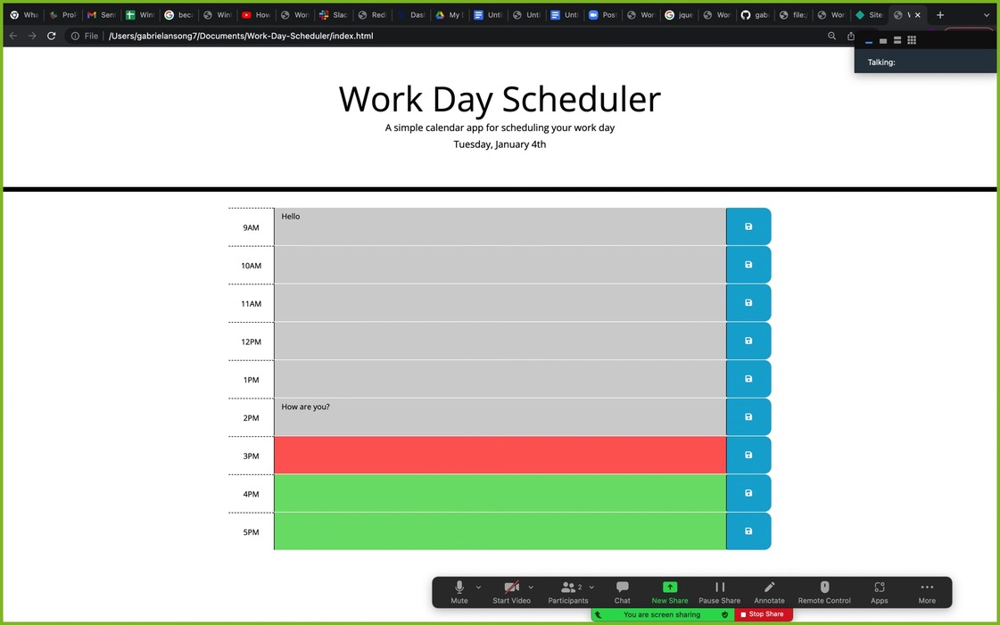

# Work Day Scheduler

## Description

In this project, I created a simple calendar application that allows a user to save events for each hour of the day by modifying starter code. This app will run in the browser and feature dynamically updated HTML and CSS powered by jQuery.

## Technology

HTML
CSS/Bootstrap
JS/Moment.js/jQuery

## Usage

As the current day is displayed at the top of the calender, user can scrool down to the appropriate time-block and enter an entry and then click save button.

### Image of Deployed App

### Deployed Link

[Work-Day-Scheduler](https://www.example.com)
